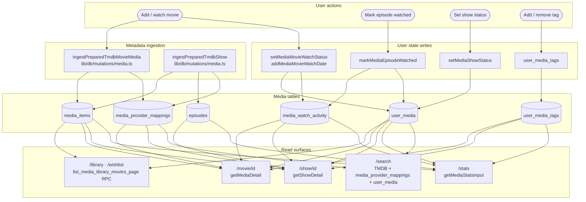

# Nodi — Data Flow and Information Architecture

This document maps where data is written and where it is read for every major
user action. Use it to debug library/stats mismatches, to understand which
tables a new feature must touch, and to verify that a write path is complete
end-to-end.

---

## Architecture diagram



## Table Overview

| Table | Purpose |
| --- | --- |
| `media_items` | Shared movie and show metadata from TMDB |
| `episodes` | TV episode rows belonging to a show `media_items` row |
| `media_provider_mappings` | TMDB, IMDb, and Trakt IDs for movies, shows, and episodes |
| `user_media` | Per-user movie and show state: status, rating, watchlist date, completion date |
| `media_watch_activity` | Per-user movie and episode watch events |
| `user_media_tags` | Per-user tag attachments for movies and shows |
| `tags` | Per-user tag names |
| `sync_events` | Outbound/inbound provider sync audit and queue |
| `sync_runs` / `sync_item_failures` / `sync_cursors` | Provider sync progress, retry, and cursor state |

Watch history stays event-based in `media_watch_activity`. `user_media` stores
the current state summary, but analytics and date filtering use activity rows.

## Movies

### Ingesting a Movie from TMDB

Entry points: `markTmdbWatchedAction` / `addTmdbToWatchlistAction`
(`app/(shell)/movie/actions.ts`)

```
ingestPreparedTmdbMovieMedia
  -> media_items              upsert movie metadata
  -> media_provider_mappings  upsert TMDB and IMDb provider IDs

setMediaMovieWatchStatus
  -> user_media               upsert status: done | wishlist
  -> media_watch_activity     insert a watch event when status = done
  -> sync_events              queue Trakt push unless source = trakt_sync
```

### Updating an Existing Movie

| Action | Write path |
| --- | --- |
| Mark watched | `setMediaMovieWatchStatus` -> `user_media` + `media_watch_activity` |
| Add rewatch date | `addMediaMovieWatchDate` -> `media_watch_activity`, then refreshes `user_media.last_watched_at` |
| Move to wishlist | `setMediaMovieWatchStatus` -> `user_media` |
| Remove from library | `removeUserMediaMovie` -> `user_media`, `media_watch_activity`, `user_media_tags` |
| Update rating | `updateMediaMovieRating` -> `user_media.personal_rating` |
| Edit/delete watch date | `updateMediaMovieWatchActivityDate` / `deleteMediaMovieWatchActivity` -> `media_watch_activity`, then refreshes `user_media.last_watched_at` |
| Add/remove tag | media tag mutations -> `tags` + `user_media_tags` |

### Movie Reads

| Surface | Query | Tables read |
| --- | --- | --- |
| Library (`/library`) | `listMediaLibraryMoviesPage` -> `list_media_library_movies_page` RPC | `user_media` + `media_items` + filters from `media_watch_activity` / `user_media_tags` |
| Wishlist (`/wishlist`) | same RPC, `p_status = 'to_watch'` | `user_media` + `media_items` |
| Movie detail (`/movie/[movieId]`) | `getMediaDetail` | `media_items` + `user_media` + `media_watch_activity` + `user_media_tags` + `media_provider_mappings` |
| Search results | TMDB API plus local state lookup | `media_provider_mappings` + `user_media` |
| Stats | `getMediaStatsInput` | `media_watch_activity` + `user_media` + `user_media_tags` + `media_items` |

## Shows

Shows use the same media tables as movies, with episode rows added under the
show media item.

### Ingesting a Show from TMDB

Entry point: `ingestTmdbShow` / `ingestPreparedTmdbShow`
(`lib/db/mutations/media.ts`)

```
ingestPreparedTmdbShow
  -> media_items              upsert show metadata
  -> media_provider_mappings  upsert show TMDB provider ID
  -> episodes                 upsert season/episode metadata
  -> media_provider_mappings  upsert episode TMDB provider IDs
```

### Show and Episode State

| Action | Write path |
| --- | --- |
| Add to library / wishlist | `setMediaShowStatus` -> `user_media` |
| Mark episode watched | `markMediaEpisodeWatched` -> `media_watch_activity`, then refreshes `user_media` |
| Mark episode unwatched | `deleteMediaEpisodeWatchActivity` -> `media_watch_activity`, then refreshes `user_media` |
| Mark show done / stopped / resume | `setMediaShowStatus` -> `user_media` |
| Add/remove tag | media tag mutations -> `tags` + `user_media_tags` |

Show completion is derived from non-special aired episodes. When all regular
aired episodes are watched, `refreshShowWatchedState` can set
`user_media.status = 'done'` with `completion_mode = 'auto_all_aired'`.

### Show Reads

| Surface | Query | Tables read |
| --- | --- | --- |
| Library (`/library`) | `listMediaLibraryMoviesPage` RPC | `user_media` + `media_items` |
| Wishlist (`/wishlist`) | same RPC | `user_media` + `media_items` |
| Show detail (`/show/[showId]`) | `getShowDetail` | `media_items` + `user_media` + `episodes` + `media_watch_activity` + `user_media_tags` + `media_provider_mappings` |
| Episode detail | `getEpisodeDetail` | `episodes` + `media_items` + `user_media` + `media_watch_activity` |
| Stats | `getMediaStatsInput` | `media_watch_activity` + `user_media` + `user_media_tags` + `media_items` + `episodes` |

## Sync

Trakt pull writes movies and shows into the same media tables:

```
Trakt pull
  -> media_items / episodes / media_provider_mappings
  -> user_media
  -> media_watch_activity
  -> user_media_tags for list imports
  -> sync_cursors / sync_runs / sync_item_failures
```

Outbound user actions queue `sync_events` unless their source is `trakt_sync`.
Push resolution uses `media_items` plus `media_provider_mappings` to build Trakt
payloads.

## Debugging Checklist

When a saved item is missing from a surface:

1. Check `media_items` for the item UUID and type.
2. Check `user_media` for the current user and media ID.
3. Check `media_provider_mappings` when search or sync cannot resolve provider IDs.
4. Check `media_watch_activity` when stats, watched dates, or rewatch counts look wrong.
5. Check `user_media_tags` when tag filters or tag displays are wrong.
