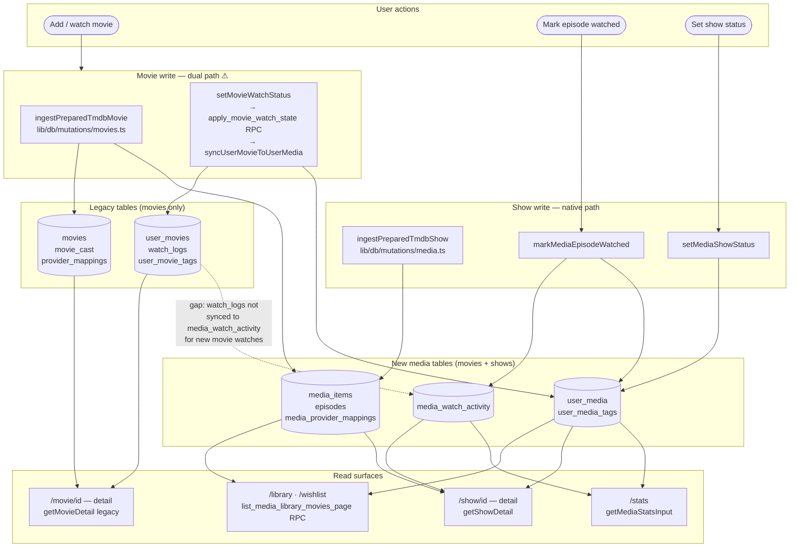

# Nodi — Data Flow and Information Architecture

This document maps where data is written and where it is read for every major
user action. Use it to debug library/stats gaps, to understand which tables a
new feature must touch, and to verify that a write path is complete end-to-end.

---

## Architecture diagram



**Reading the diagram:**
- Movie writes go to **both** legacy tables and new media tables (dual path, marked ⚠).
  The library and stats read only from the new tables — any break in the bridge sync makes
  a movie invisible in the library even though it exists in the legacy tables.
- Show writes go **only** to the new media tables. There is no legacy show table.
- The dashed line is the known gap: watch events for movies land in `watch_logs` (legacy)
  but not in `media_watch_activity` (new). Stats and date-filter queries are blind to them
  until a backfill migration runs or the write path is migrated (task 139).

---

## Table overview

| Table | Layer | Purpose |
| --- | --- | --- |
| `movies` | Legacy | Movie metadata (title, poster, runtime, genre, language) |
| `movie_cast` | Legacy | Cast rows per movie |
| `provider_mappings` | Legacy | TMDB / IMDb external IDs per movie |
| `user_movies` | Legacy | Per-user movie state (status, rating, dates) |
| `watch_logs` | Legacy | Per-user movie watch events |
| `user_movie_tags` | Legacy | Many-to-many tags for movies |
| `media_items` | New | Unified movie + show metadata (same UUID as `movies` for movies) |
| `episodes` | New | TV episode rows belonging to a show `media_items` row |
| `media_provider_mappings` | New | TMDB / IMDb / Trakt IDs for movies, shows, and episodes |
| `user_media` | New | Per-user movie + show state (status, rating, dates) |
| `media_watch_activity` | New | Per-user movie + episode watch events |
| `user_media_tags` | New | Many-to-many tags for movies and shows |

**Key invariant:** For movies, `movies.id = media_items.id`. The UUID is
identical so the legacy and new tables join without any extra mapping.

---

## Movies — Write path

### Ingesting a new movie from TMDB

Entry points: `markTmdbWatchedAction` / `addTmdbToWatchlistAction`
(`app/(shell)/movie/actions.ts`)

```
ingestPreparedTmdbMovie (lib/db/mutations/movies.ts)
  → movies            upsert on tmdb_id
  → movie_cast        delete-then-insert per movie
  → provider_mappings upsert on (provider, provider_movie_id)
  → media_items       upsert on id  (same UUID as movies.id)
  → media_provider_mappings  (currently not written here — see gap below)

setMovieWatchStatus (lib/db/mutations/movies.ts)
  → apply_movie_watch_state RPC
      → user_movies   upsert on (user_id, movie_id)
      → watch_logs    insert (one row per watch event)
  → syncUserMovieToUserMedia
      → user_media    upsert on (user_id, media_id)   status: done | wishlist
```

**What is NOT written automatically:**

- `media_watch_activity` — written by `setMediaMovieWatchStatus` (new path, not
  yet used for movies added from the TMDB detail page). Movie watch events
  currently live in `watch_logs` only. The `legacy_watch_log_id` column on
  `media_watch_activity` is the bridge; a backfill migration can populate it.
- `media_provider_mappings` for newly ingested movies — added during the initial
  schema migration but not yet wired into `ingestPreparedTmdbMovie`. Legacy
  `provider_mappings` remains the source of truth for provider IDs.

### Updating watch state for an existing local movie

Entry points: movie detail actions (`app/(shell)/movie/[movieId]/actions.ts`)

Same path as above: `setMovieWatchStatus` → RPC → `user_movies` + `watch_logs`
→ `syncUserMovieToUserMedia` → `user_media`.

---

## Movies — Read path

| Surface | Query | Tables read |
| --- | --- | --- |
| Library (`/library`) | `listMediaLibraryMoviesPage` → `list_media_library_movies_page` RPC | `user_media` + `media_items` |
| Wishlist (`/wishlist`) | same RPC, `p_status = 'to_watch'` | `user_media` + `media_items` |
| Movie detail (`/movie/[movieId]`) | `getMovieDetail` (legacy) | `movies` + `user_movies` + `watch_logs` + `user_movie_tags` |
| Stats | `getMediaStatsInput` | `media_watch_activity` + `user_media` + `user_media_tags` |
| Library filter summary | `getMediaWatchedMovieLibrarySummary` | `media_watch_activity` |
| Search results | TMDB API + local join on `movies.tmdb_id` | `movies` + `user_movies` |

**Critical:** the library and wishlist read from `user_media` + `media_items`.
Any movie not in both of those tables will be invisible in the library, even if
it is in `user_movies` + `movies`. Stats reads from `media_watch_activity`, not
`watch_logs`, so watch events not backfilled there are invisible to analytics.

---

## Shows — Write path

Shows have **no legacy table**. All show data goes directly to the new media
tables from the start.

### Ingesting a show from TMDB

Entry point: `ingestTmdbShow` / `ingestPreparedTmdbShow`
(`lib/db/mutations/media.ts`)

```
ingestPreparedTmdbShow
  → media_items             upsert on id  (show row, type = 'show')
  → media_provider_mappings upsert on (provider, provider_media_type, provider_id)
  → episodes                upsert on (show_id, season_number, episode_number)
  → media_provider_mappings upsert per episode
```

### Setting show status

Entry point: `setMediaShowStatus` (`lib/db/mutations/media.ts`)

```
setMediaShowStatus
  → user_media    upsert on (user_id, media_id)   status: done | watching | stopped | wishlist
```

### Marking an episode watched

Entry point: `markMediaEpisodeWatched` (`lib/db/mutations/media.ts`)

```
markMediaEpisodeWatched
  → media_watch_activity   insert (episode_id set, media_id = show id)
  → refreshShowMediaLastWatchedAt
      → user_media         upsert (updates status, last_watched_at, completed_at)
```

---

## Shows — Read path

| Surface | Query | Tables read |
| --- | --- | --- |
| Library (`/library`) | `listMediaLibraryMoviesPage` RPC | `user_media` + `media_items` |
| Wishlist (`/wishlist`) | same RPC | `user_media` + `media_items` |
| Show detail (`/show/[showId]`) | `getShowDetail` | `media_items` + `user_media` + `episodes` + `media_watch_activity` |
| Episode detail | `getEpisodeDetail` | `episodes` + `media_items` + `user_media` + `media_watch_activity` |
| Stats | `getMediaStatsInput` | `media_watch_activity` + `user_media` + `user_media_tags` |

---

## The dual-table problem (movies)

Movies currently have a split write path:

```
TMDB action
  ├─ ingestPreparedTmdbMovie → movies (primary) + media_items (bridge sync)
  └─ setMovieWatchStatus     → user_movies (primary) + user_media (bridge sync)
```

The library and stats read from the **new** tables only. The movie detail page
reads from the **legacy** tables. This works as long as both sides stay in sync,
but any gap — such as adding a movie before the bridge sync was in place —
leaves the movie visible in detail but invisible in the library.

**Planned resolution:** task 139 in `progress_nodi.md` will migrate the movie
write path entirely to the new media tables (`media_items`, `user_media`,
`media_watch_activity`) and retire the legacy write calls.

---

## Data flow diagram

```
User action (TMDB detail page)
       │
       ▼
ingestPreparedTmdbMovie
       │
       ├──► movies ──────────────────────► movie detail page reads here
       │
       └──► media_items ────────────────► library / wishlist / stats read here
                │
                └──► (gap) media_provider_mappings not written inline

setMovieWatchStatus → apply_movie_watch_state RPC
       │
       ├──► user_movies + watch_logs ───► movie detail page reads here
       │
       └──► syncUserMovieToUserMedia
                │
                └──► user_media ─────────► library / wishlist read here

                     (gap) media_watch_activity ─► stats reads here
                           currently only has data from backfill migrations
                           not from new watch events via legacy path
```

---

## Known write-path gaps

| Gap | Impact | Mitigation |
| --- | --- | --- |
| `media_watch_activity` not written when movies are watched via legacy path | Watch events invisible to stats; date filter in library returns no results for recent watches | Backfill migration `20260528130000` covers historical gap; full fix in task 139 |
| `media_provider_mappings` not written inline by `ingestPreparedTmdbMovie` | Sync push events may not find provider IDs | Legacy `provider_mappings` still used by sync; full fix in task 139 |
| Movies added between initial backfill and write-path sync fix missing from `media_items`/`user_media` | Movies invisible in library | Backfill migration `20260528130000` fixes this |
